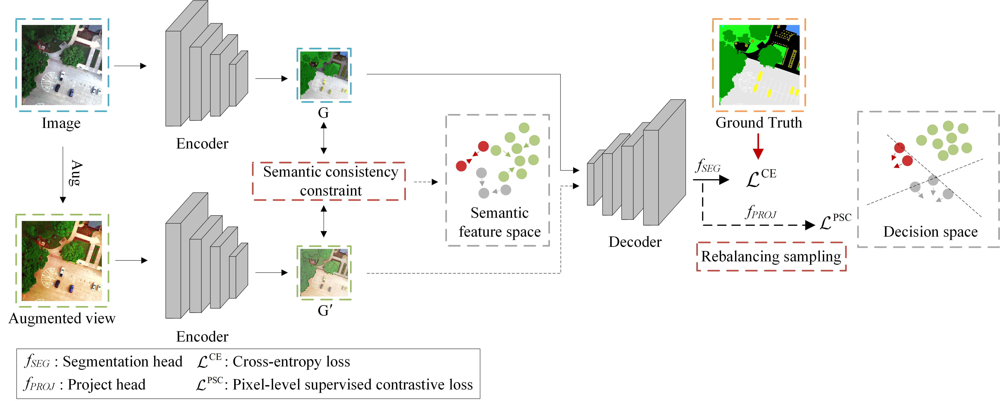

# Semantic segmentation of multispectral remote sensing images with class imbalance using contrastive learning

---------------------

This code is the implementation of ["Semantic segmentation of multispectral remote sensing images with class imbalance using contrastive learning"].

More specifically, it is detailed as follows.

## Environment

PyTorch >= 1.7.0

## Model

Fig: The framework of the proposed CoLM.

## Dataset

 The RIT-18 dataset is available at https://github.com/rmkemker/RIT-18. [Kemker R, Salvaggio C, Kanan C. Algorithms for semantic segmentation of multispectral remote sensing imagery using deep learning[J]. ISPRS journal of photogrammetry and remote sensing, 2018, 145: 60-77.]
 The LASA-JILIN dataset is collected and annotated by us and is available upon reasonable request to the corresponding author.

## Others

We provide all modules of CoLM here, and the baseline model is available from the original paper. 
If necessary, we will supplement it later.

Licensing
---------
Copyright (c) 2022 Zhengyin Liang. Released under the MIT License.
